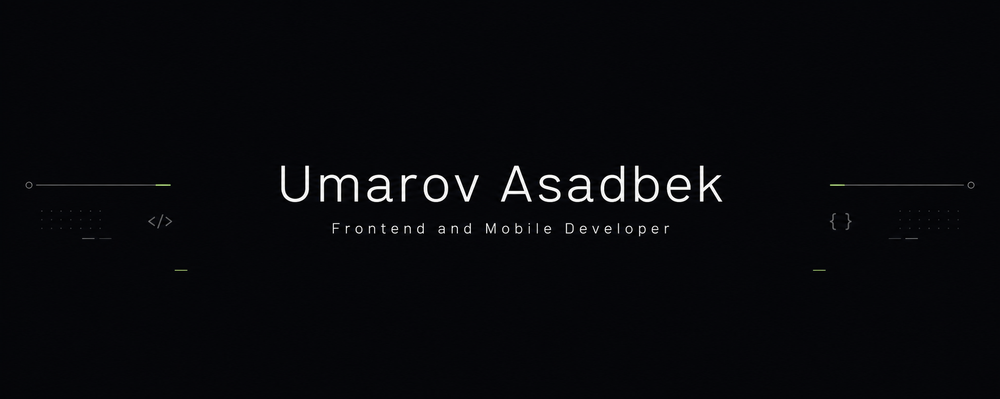

### Frontend & Mobile Developer

React · Next.js · TypeScript · React Native

<a href="https://portfolio-umarov-asadbek.vercel.app/">Portfolio</a> ·
<a href="https://www.linkedin.com/in/asadbek-umarov/">LinkedIn</a> ·
<a href="https://t.me/Asad_umarov">Telegram</a>

 

---

## About Me

Frontend & Mobile Developer focused on building clean, responsive and scalable applications with modern JavaScript technologies.

I enjoy turning ideas and designs into functional products, improving code quality and learning through real-world projects.

---

## Tech Stack

### Frontend

### Mobile

### State Management & Data

### Tools

---

## Currently Working On

- 🔭 Preparing for frontend interviews with a focus on **JavaScript, React, Redux and TypeScript**
- 🌱 Improving my English from **A2 → B1** and continuing to learn through personal projects
- 🚀 Working with a team on a **startup evaluation and certification platform**

---

---

## Connect

If you would like to collaborate, discuss a project or invite me to join your team, feel free to reach out.

 

